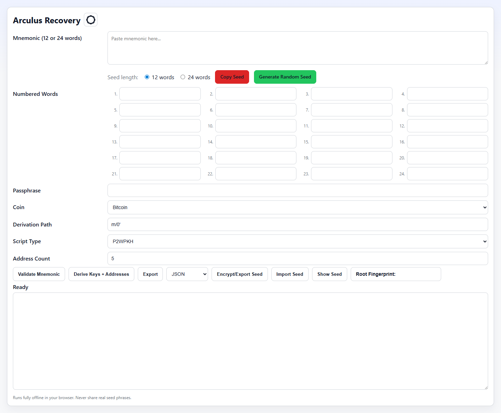
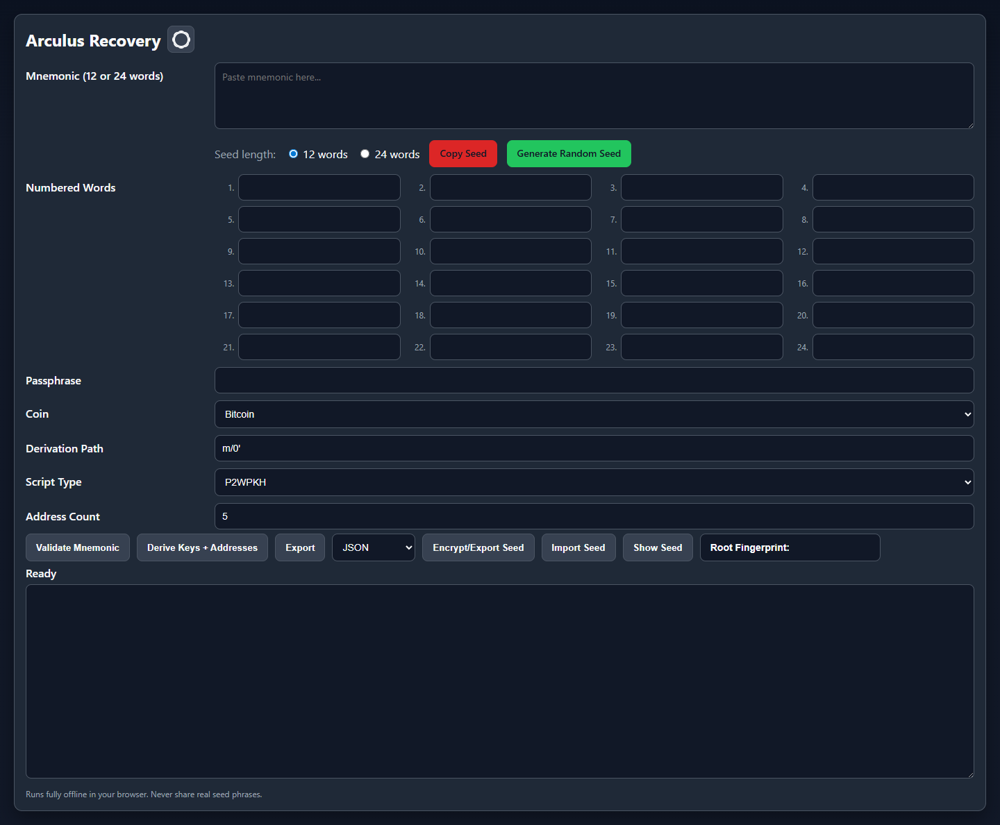

# Arculus Recovery

Offline BIP39/BIP32 recovery and key-derivation tool with both:

- a browser-based interface in `Arculus_Recovery.html`
- a Python desktop/CLI version in `Arculus_Recovery.py`

This project is designed to run fully offline and uses only local computation.

## Screenshots

Light mode:



Dark mode:



## Features

- BIP39 mnemonic validation for 12-word and 24-word seeds
- Detailed validation output:
  - Word count
  - Wordlist validity
  - Entropy bits
  - Checksum bits
  - Checksum match
  - BIP-39 compliance
  - Root fingerprint
  - Keystore / seed format detection
  - Passphrase warning
  - BIP-39 seed (512-bit)
  - Master private key
  - Master chain code
- Address derivation for:
  - P2PKH
  - P2WPKH-P2SH
  - P2WPKH
  - P2TR (Taproot)
- Taproot support includes:
  - Bech32m addresses
  - BIP86 purpose detection (`m/86'/coin'/0'`)
  - Taproot internal public/private key data
  - Taproot tweak
  - Taproot output public/private key data
  - Taproot output key parity
- Multi-coin support:
  - Bitcoin
  - Litecoin
  - Dogecoin
- Encrypted seed export/import
- Export derived keys/addresses:
  - HTML: JSON, CSV, or TXT
  - Python GUI: JSON, CSV, or TXT
- Hidden imported-seed workflow
- Press-and-hold seed reveal
- Inline root fingerprint display
- Settings dialog with Dark Mode toggle

## Derivation Paths

The tool derives account-level extended keys from the selected derivation path, then derives both receiving and change addresses:

- Receiving addresses: `<account path>/0/index`
- Change addresses: `<account path>/1/index`

Common account paths:

| Coin | Script type | Common account path | Address format | Notes |
| --- | --- | --- | --- | --- |
| Bitcoin | P2PKH | `m/44'/0'/0'` | `1...` | Legacy BIP44 |
| Bitcoin | P2WPKH-P2SH | `m/49'/0'/0'` | `3...` | Wrapped SegWit |
| Bitcoin | P2WPKH | `m/84'/0'/0'` | `bc1q...` | Native SegWit |
| Bitcoin | P2TR | `m/86'/0'/0'` | `bc1p...` | Taproot / BIP86 |
| Litecoin | P2PKH | `m/44'/2'/0'` | `L...` | Legacy BIP44 |
| Litecoin | P2WPKH-P2SH | `m/49'/2'/0'` | `M...` | Wrapped SegWit |
| Litecoin | P2WPKH | `m/84'/2'/0'` | `ltc1q...` | Native SegWit; default Litecoin path |
| Litecoin | P2TR | `m/86'/2'/0'` | `ltc1p...` | Taproot-style output |
| Dogecoin | P2PKH | `m/44'/3'/0'` | `D...` | Default Dogecoin path |
| Dogecoin | P2WPKH-P2SH | `m/49'/3'/0'` | `9...` or `A...` | Supported by the tool, but wallet support may vary |
| Dogecoin | P2WPKH | `m/84'/3'/0'` | `doge1q...` | Supported by the tool, but wallet support may vary |
| Dogecoin | P2TR | `m/86'/3'/0'` | Not supported | Dogecoin Taproot is disabled in the tool |

The browser and Python GUI default to `m/0'` for Bitcoin, `m/84'/2'/0'` for Litecoin, and `m/44'/3'/0'` for Dogecoin. Use `Auto` script type to infer the script from BIP44/49/84/86 purpose when using standard paths.

## Security Notes

This tool is intended to be used offline.

Recommended usage:

1. Disconnect from the internet
2. Open the HTML file locally or run the Python script on a trusted machine
3. Never share your seed phrase, exported files, passwords, or derived private keys
4. Treat encrypted seed exports as sensitive backups

## Hash Verification

Verify the SHA256 hashes before using the recovery tool:

```bash
shasum -a 256 Arculus_Recovery.html index.html Arculus_Recovery.py
```

Expected hashes:

```text
4298d676d6216b861e788bad94efb49c711f62cc355fc2c50aed0cd6d0e7441f  Arculus_Recovery.html
4298d676d6216b861e788bad94efb49c711f62cc355fc2c50aed0cd6d0e7441f  index.html
77938bbe0d3e2c8959d03afa28d04dbd9e3b3e78e1a70bb5716aea4e507e0f4e  Arculus_Recovery.py
```

## Encrypted Seed Files

The project supports encrypted seed backup/export using the `.arc` file extension.

### Behavior

- `Encrypt/Export Seed` saves the active mnemonic into an encrypted `.arc` file
- `Import Seed` loads a `.arc` file back into the app
- Imported seeds remain hidden on screen
- Imported hidden seeds can still be validated and used for key derivation
- `Show Seed` temporarily reveals the hidden imported seed only while held down

### Compatibility

New `.arc` exports are designed to work in both:

- `Arculus_Recovery.html`
- `Arculus_Recovery.py`

### File Format

Current `.arc` exports are armored UTF-8 text. Opening the file shows an opaque envelope rather than readable JSON metadata:

```text
ARCULUS-ARC-V2
eyJjaXBoZXIiOnsibmFtZSI6IkhNQUMtU0hBNTEyLUNUUiIsIm5vbmNlX2I2NCI6Ii4uLiJ9LCIuLi4iOiIuLi4ifQ==
```

The armored body contains a base64-encoded version 2 metadata bundle. This keeps the file format compact and less casually inspectable, while still requiring the password and MAC verification before the seed can be decrypted.

High-level behavior:

- The password is normalized with Unicode NFKD before key derivation.
- PBKDF2-HMAC-SHA512 derives a 64-byte master key from the password and a 32-byte random salt.
- New exports use 1,000,000 KDF iterations.
- Existing version 2 imports with 600,000 or more iterations remain supported.
- Encryption and authentication keys are separated with domain-specific HMAC-SHA512 labels.
- The plaintext payload is JSON containing the normalized mnemonic, word count, and creation timestamp.
- The plaintext is encrypted with an HMAC-SHA512 counter stream using a 24-byte random nonce.
- `mac_b64` is HMAC-SHA512 over the versioned file metadata, salt, nonce, and ciphertext.
- Binary fields inside the armored bundle are base64 encoded.

Decrypted plaintext payload:

```json
{
  "mnemonic": "abandon ... about",
  "word_count": 12,
  "created_at": "2026-05-03T23:59:59.000Z"
}
```

Importers should ignore unknown plaintext fields for forward compatibility.

Supported import formats:

- Current armored `ARCULUS-ARC-V2` files
- JSON `arculus-encrypted-seed-v2` files with `magic: "ARCULUS-ARC"` and `version: 2`
- Legacy PBKDF2-SHA256 + XOR-HMAC files without the magic header
- Legacy `arculus-encrypted-seed-python-v1` files
- `arculus-encrypted-seed-v1` in the browser version only, for legacy AES-GCM exports

## Files

- `Arculus_Recovery.html`  
  Browser-based offline recovery tool

- `Arculus_Recovery.py`  
  Python version with GUI and CLI support

- `docs/screenshots/`  
  README screenshots for light and dark mode

## HTML Version

Open `Arculus_Recovery.html` directly in a browser.

### HTML Features

- Offline mnemonic validation
- Key and address derivation
- Export derived keys and addresses as JSON, CSV, or TXT
- Encrypt/export seed to `.arc`
- Import encrypted seed from `.arc`
- Hold-to-show hidden imported seed
- Root fingerprint display in the action toolbar
- Settings dialog beside the title with a Dark Mode toggle

## Python Version

Run the Python script directly. It has both a desktop GUI and a CLI mode.

### Launch GUI

```bash
python Arculus_Recovery.py --gui
```

### Python GUI Features

- Offline mnemonic validation
- Key and address derivation
- Export derived keys and addresses as JSON, CSV, or TXT
- Encrypt/export seed to `.arc`
- Import encrypted seed from `.arc`
- Hold-to-show hidden imported seed
- Root fingerprint display in the action toolbar
- Settings popup with a Dark Mode toggle

### CLI Example

```bash
python Arculus_Recovery.py --mnemonic "abandon abandon abandon abandon abandon abandon abandon abandon abandon abandon abandon about" --derivation "m/84'/0'/0'" --script-type p2wpkh --count 5 --output-format txt
```

CLI output formats are `json`, `csv`, and `txt`. JSON is the default.
