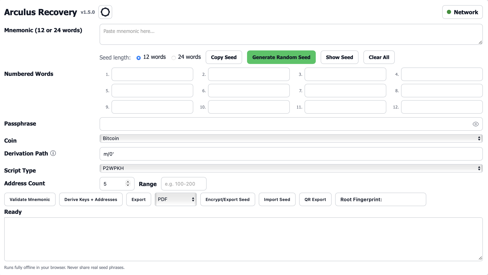
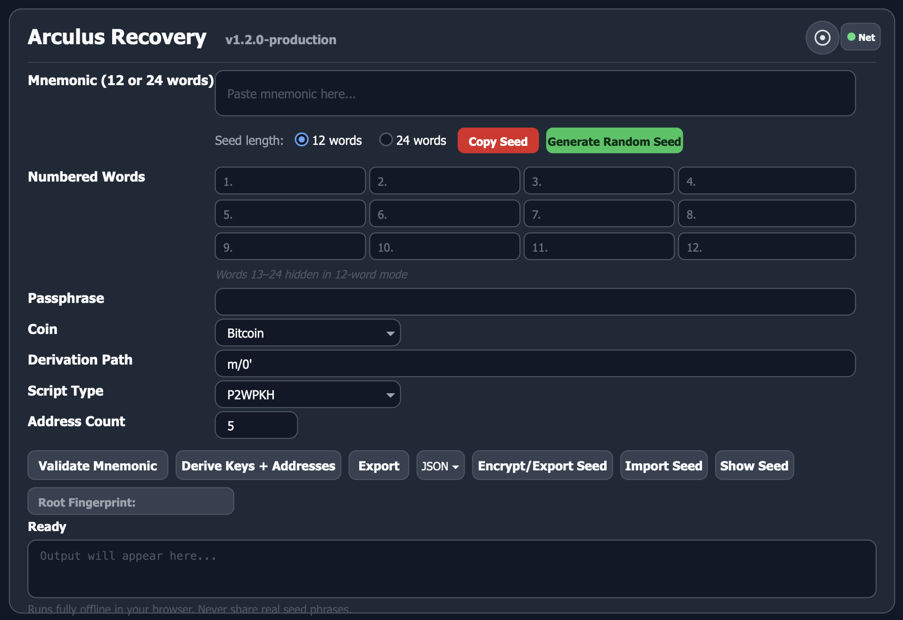
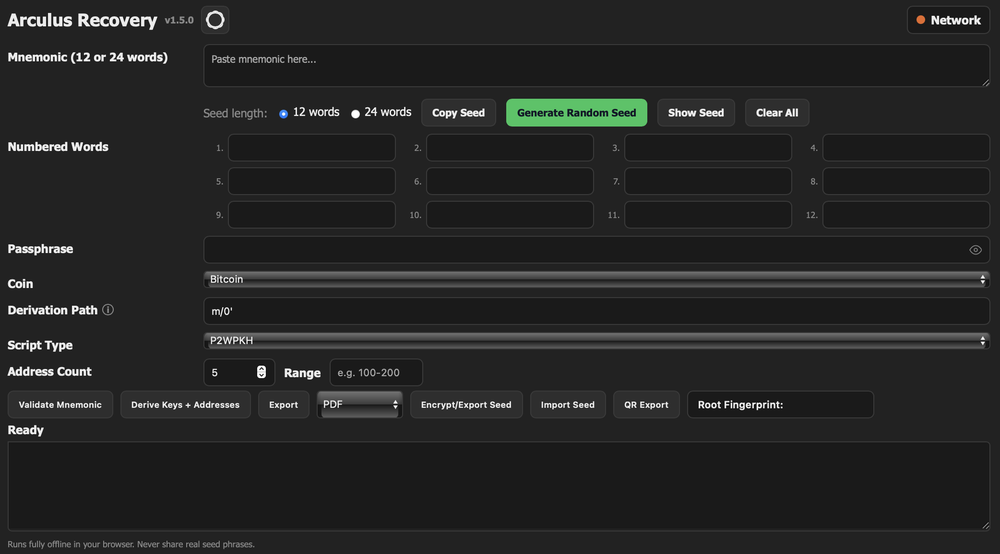

# Arculus Recovery

Offline BIP39/BIP32 recovery and key-derivation tool with both:

- a browser-based interface in `Arculus_Recovery.html`
- a Python desktop/CLI version in `Arculus_Recovery.py`

This project is designed to run fully offline and uses only local computation. No external libraries or network requests are required.

## Screenshots

Light mode:



Dark mode:



Dark+ mode:



## Features

- BIP39 mnemonic validation for 12-word and 24-word seeds
- Generate a cryptographically random 12-word or 24-word mnemonic
- Individual word-entry grid with 12/24 selector and inline validation
- Word slots 13–24 hidden automatically in 12-word mode, revealed on switch to 24 words
- Seed mask character displayed as bullets (••••) rather than asterisks
- Detailed validation output:
  - Word count
  - Wordlist validity
  - Entropy bits
  - Checksum bits
  - Checksum match
  - BIP-39 compliance
  - Root fingerprint
  - Keystore / seed format detection
  - Passphrase warning
  - BIP-39 seed (512-bit)
  - Master private key
  - Master chain code
- Address derivation for:
  - P2PKH
  - P2WPKH-P2SH
  - P2WPKH
  - P2TR (Taproot)
- Taproot support:
  - Bech32m addresses
  - BIP86 purpose detection (`m/86'/coin'/0'`)
  - Taproot internal public/private key data
  - Taproot tweak
  - Taproot output public/private key data
  - Taproot output key parity
- Multi-coin support:
  - Bitcoin
  - Litecoin
  - Dogecoin
  - Ethereum and ERC-20 tokens
  - XRP
- QR Export — generate a scannable QR code from any address with no external dependencies
- Encrypted seed export/import via `.arc` files
- Export derived keys/addresses as JSON, CSV, TXT, or PDF
- PDF export includes title block, root fingerprint, extended keys section, and full address table
- Hidden imported-seed workflow
- Press-and-hold seed reveal
- Inline root fingerprint display
- Clear All — wipes all fields and protected seed state in one action
- Settings dialog with Light / Dark / Dark+ theme selector

## Derivation Paths

The tool derives account-level extended keys from the selected derivation path, then derives both receiving and change addresses:

- Receiving addresses: `<account path>/0/index`
- Change addresses: `<account path>/1/index`

Common account paths:

| Coin | Script type | Common account path | Address format | Notes |
| --- | --- | --- | --- | --- |
| Bitcoin | P2PKH | `m/44'/0'/0'` | `1...` | Legacy BIP44 |
| Bitcoin | P2WPKH-P2SH | `m/49'/0'/0'` | `3...` | Wrapped SegWit |
| Bitcoin | P2WPKH | `m/84'/0'/0'` | `bc1q...` | Native SegWit |
| Bitcoin | P2TR | `m/86'/0'/0'` | `bc1p...` | Taproot / BIP86 |
| Litecoin | P2PKH | `m/44'/2'/0'` | `L...` | Legacy BIP44 |
| Litecoin | P2WPKH-P2SH | `m/49'/2'/0'` | `M...` | Wrapped SegWit |
| Litecoin | P2WPKH | `m/84'/2'/0'` | `ltc1q...` | Native SegWit; default Litecoin path |
| Litecoin | P2TR | `m/86'/2'/0'` | `ltc1p...` | Taproot-style output |
| Dogecoin | P2PKH | `m/44'/3'/0'` | `D...` | Default Dogecoin path |
| Dogecoin | P2WPKH-P2SH | `m/49'/3'/0'` | `9...` or `A...` | Supported by the tool, but wallet support may vary |
| Dogecoin | P2WPKH | `m/84'/3'/0'` | `doge1q...` | Supported by the tool, but wallet support may vary |
| Dogecoin | P2TR | `m/86'/3'/0'` | Not supported | Dogecoin Taproot is disabled in the tool |
| Ethereum / ERC-20 | Account | `m/44'/60'/0'` | `0x...` | ERC-20 tokens use the same Ethereum address |
| XRP | Account | `m/44'/144'/0'` | `r...` | Destination tags are not derived from the seed |

The browser and Python GUI default to `m/0'` for Bitcoin (the Arculus-native path), `m/84'/2'/0'` for Litecoin, `m/44'/3'/0'` for Dogecoin, `m/44'/60'/0'` for Ethereum / ERC-20, and `m/44'/144'/0'` for XRP.

The Bitcoin default `m/0'` is a single hardened account level used natively by the Arculus hardware wallet. It differs from the BIP-44 standard path `m/44'/0'/0'`. If you are recovering a seed originally set up in a different wallet, change the derivation path to match that wallet's convention. An info tooltip is shown beside the Derivation Path field whenever `m/0'` is active as a reminder.

Use `Auto` script type to infer the script from BIP44/49/84/86 purpose when using standard UTXO paths. Ethereum ignores UTXO script type and derives EIP-55 checksummed addresses. XRP ignores UTXO script type and derives XRPL classic addresses.

## Security Notes

This tool is intended to be used offline.

Recommended usage:

1. Disconnect from the internet
2. Open the HTML file locally or run the Python script on a trusted machine
3. Never share your seed phrase, exported files, passwords, or derived private keys
4. Treat encrypted seed exports as sensitive backups
5. Use the Clear All button or close the tab when you are finished

## Hash Verification

Verify the SHA256 hashes before using the recovery tool:

```bash
shasum -a 256 Arculus_Recovery.html Arculus_Recovery.py
```

Expected hashes:

```text
<hash for current Arculus_Recovery.html>  Arculus_Recovery.html
<hash for current Arculus_Recovery.py>    Arculus_Recovery.py
```

Update these hashes in your own copy of the README after each release.

## Themes

The HTML version includes three themes selectable from the Settings dialog:

- **Light** — default white/gray palette
- **Dark** — dark gray backgrounds with light text
- **Dark+** — near-black backgrounds with the Claude orange (`#e86926`) as the accent color, applied to focus rings, the online network indicator, status messages, toggles, and primary buttons

Theme preference is saved to `localStorage` and restored on the next page load.

## QR Export

The `QR Export` button opens a modal where you can paste any address and generate a scannable QR code. The encoder is entirely self-contained — no external libraries or network requests are used.

- Paste an address into the input field and click **Generate** or press **Enter**
- **Save PNG** downloads the QR code as an image
- **Copy Address** copies the address text to the clipboard
- In Dark+ mode the QR renders with the orange-on-dark-gray palette

## Encrypted Seed Files

The project supports encrypted seed backup and export using the `.arc` file extension.

### Behavior

- `Encrypt/Export Seed` saves the active mnemonic into an encrypted `.arc` file
- `Import Seed` loads a `.arc` file back into the app
- Imported seeds remain hidden on screen
- Imported hidden seeds can still be validated and used for key derivation
- `Show Seed` temporarily reveals the hidden imported seed only while held down
- `Clear All` removes the imported seed from memory along with all other fields

### Compatibility

New `.arc` exports work in both `Arculus_Recovery.html` and `Arculus_Recovery.py`.

### File Format

Current `.arc` exports are armored UTF-8 text:

```text
ARCULUS-ARC-V2
eyJjaXBoZXIiOnsibmFtZSI6IkhNQUMtU0hBNTEyLUNUUiIsIm5vbmNlX2I2NCI6Ii4uLiJ9LCIuLi4iOiIuLi4ifQ==
```

High-level behavior:

- Password is normalized with Unicode NFKD before key derivation
- PBKDF2-HMAC-SHA512 derives a 64-byte master key from the password and a 32-byte random salt
- New exports use 1,000,000 KDF iterations; existing version 2 imports with 600,000 or more iterations remain supported
- Encryption and authentication keys are separated with domain-specific HMAC-SHA512 labels
- The plaintext payload is JSON containing the normalized mnemonic, word count, and creation timestamp
- The plaintext is encrypted with an HMAC-SHA512 counter stream using a 24-byte random nonce
- `mac_b64` is HMAC-SHA512 over the versioned file metadata, salt, nonce, and ciphertext

Decrypted plaintext payload:

```json
{
  "mnemonic": "abandon ... about",
  "word_count": 12,
  "created_at": "2026-05-03T23:59:59.000Z"
}
```

Importers should ignore unknown plaintext fields for forward compatibility.

Supported import formats:

- Current armored `ARCULUS-ARC-V2` files
- JSON `arculus-encrypted-seed-v2` files with `magic: "ARCULUS-ARC"` and `version: 2`
- Legacy PBKDF2-SHA256 + XOR-HMAC files without the magic header
- Legacy `arculus-encrypted-seed-python-v1` files
- `arculus-encrypted-seed-v1` in the browser version only, for legacy AES-GCM exports

## Files

- `Arculus_Recovery.html` — browser-based offline recovery tool
- `Arculus_Recovery.py` — Python version with GUI and CLI support
- `docs/screenshots/` — README screenshots

## HTML Version

Open `Arculus_Recovery.html` directly in a browser. No installation required.

### HTML Features

- Offline mnemonic validation
- Individual word-entry grid with 12/24-word radio selector; words 13–24 hidden in 12-word mode
- Generate a cryptographically random 12-word or 24-word mnemonic
- Key and address derivation
- Export derived keys and addresses as JSON, CSV, TXT, or PDF (PDF is the default; includes root fingerprint, extended keys, and full address table)
- Table View shows public key hex and private key hex columns in full with inline copy buttons; no truncation applied
- QR Export — generate a QR code from any pasted address, no external dependencies
- Encrypt/export seed to `.arc`
- Import encrypted seed from `.arc`
- Hold-to-show hidden imported seed
- Clear All button to wipe all fields and protected seed state
- Root fingerprint display in the action toolbar
- Derivation path info tooltip when using the Arculus-native `m/0'` path
- Settings dialog with Light / Dark / Dark+ theme selector
- Responsive layout with a laptop breakpoint (≤1280px) for compact display on 13" screens

## Python Version

Run the Python script directly. It has both a desktop GUI and a CLI mode.

### Launch GUI

```bash
python Arculus_Recovery.py --gui
```

### Python GUI Features

- Offline mnemonic validation
- Individual word-entry grid with 12/24-word selector; words 13–24 hidden in 12-word mode
- Generate a cryptographically random 12-word or 24-word mnemonic
- Key and address derivation
- Export derived keys and addresses as JSON, CSV, or TXT
- Encrypt/export seed to `.arc`
- Import encrypted seed from `.arc`
- Hold-to-show hidden imported seed
- Root fingerprint display in the action toolbar
- Settings popup with a Dark Mode toggle
- Compact default window size (1040×760) suited for 13" laptop screens

### CLI Example

```bash
python Arculus_Recovery.py \
  --mnemonic "abandon abandon abandon abandon abandon abandon abandon abandon abandon abandon abandon about" \
  --derivation "m/84'/0'/0'" \
  --script-type p2wpkh \
  --count 5 \
  --output-format txt
```

### CLI Flags

| Flag | Description |
| --- | --- |
| `--gui` | Launch the desktop GUI |
| `--mnemonic` | BIP39 mnemonic (12 or 24 words) |
| `--passphrase` | Optional BIP39 passphrase |
| `--derivation` | Account derivation path |
| `--all-common` | Derive all common paths (`m/44'`, `m/49'`, `m/84'`, `m/86'`) for the selected coin where applicable |
| `--script-type` | One of `auto`, `p2pkh`, `p2wpkh-p2sh`, `p2wpkh`, `p2tr` |
| `--count` | Number of addresses to derive (default: 5) |
| `--coin` | One of `bitcoin`, `litecoin`, `dogecoin`, `ethereum`, `xrp` (default: `bitcoin`) |
| `--testnet` | Use testnet network parameters |
| `--output-format` | One of `json`, `csv`, `txt` (default: `json`) |
| `--version` | Print version and exit |
