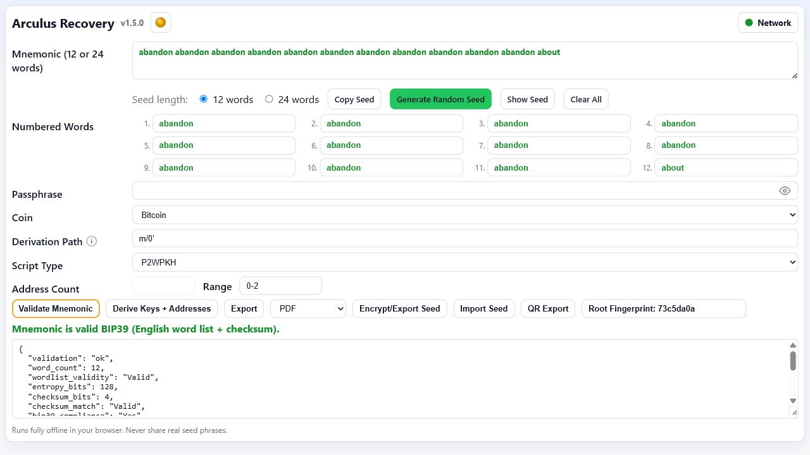
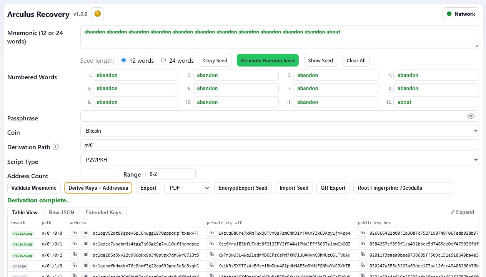
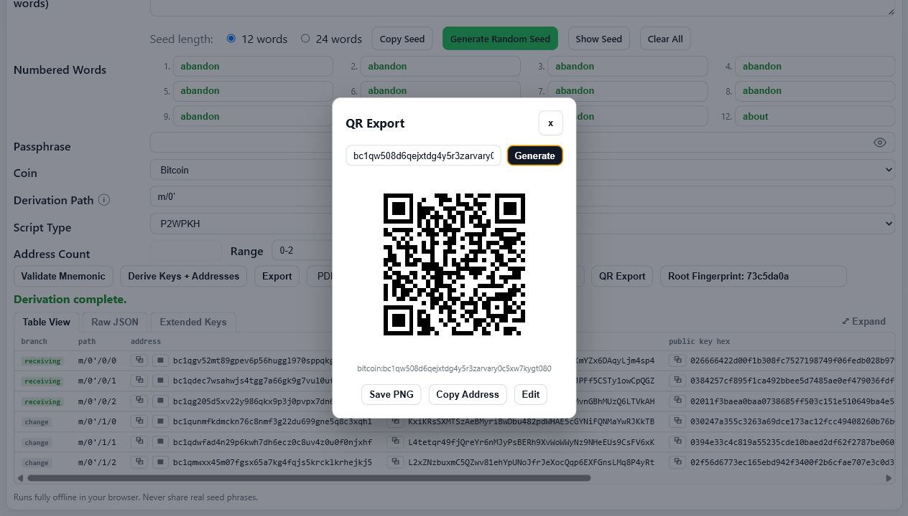
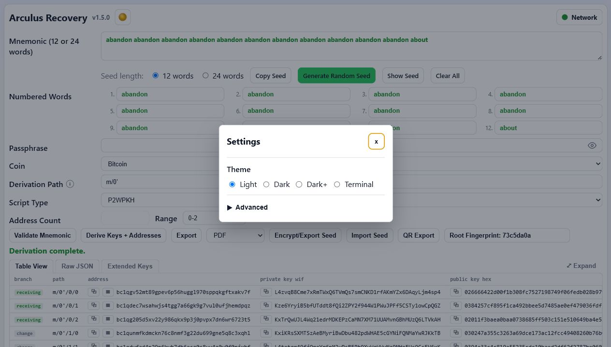
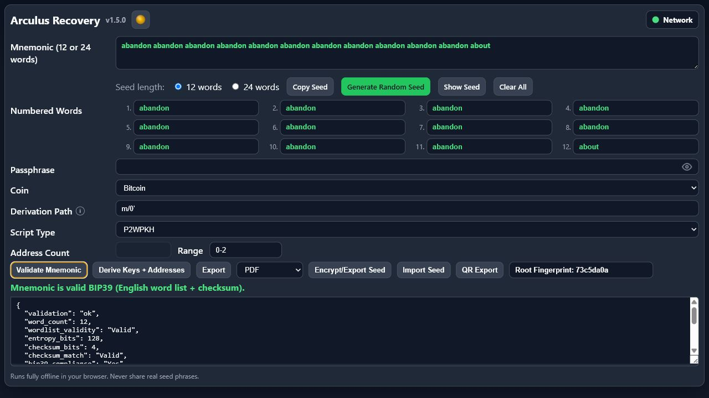
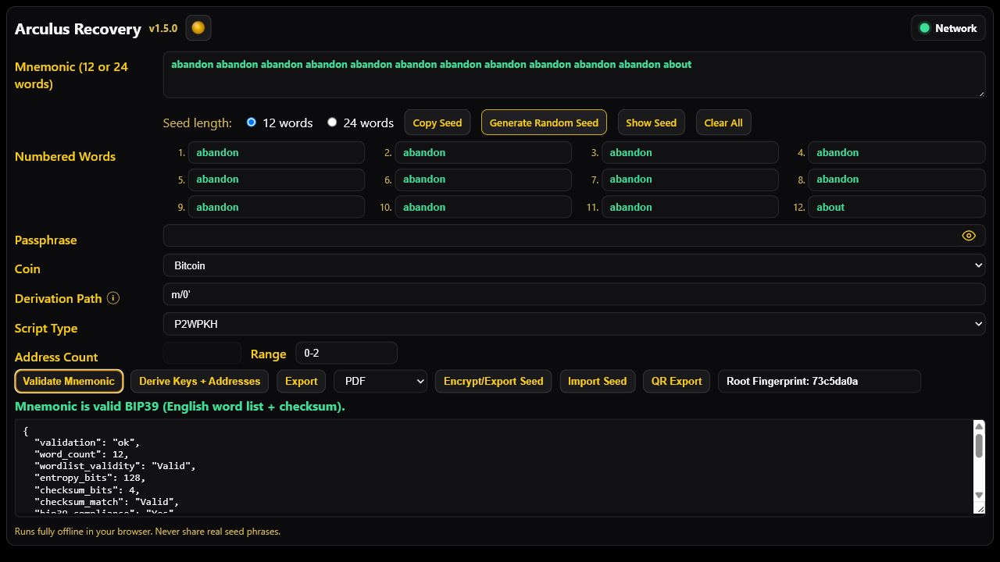

# Arculus Recovery

Offline BIP39/BIP32 recovery and key-derivation tool with:

- a standalone browser-based interface in `Arculus_Recovery.html`
- a working next-release Beta build in `Arculus_Recovery_Beta.html`
- a PySide6 desktop wrapper and Python CLI in `Arculus_Recovery.py`
- a Tauri desktop package that wraps the same canonical HTML application

This project is designed to run fully offline and uses only local computation. The HTML app remains self-contained; the Python desktop GUI now depends on PySide6 so it can render that exact HTML interface.

## Beta Build

`Arculus_Recovery_Beta.html` is the working build for the next release. Use it for current next-release validation while keeping `Arculus_Recovery.html` as the main release HTML until Beta is promoted.

## User Guide

The current PDF manual is [docs/Arculus_Recovery_Manual.pdf](docs/Arculus_Recovery_Manual.pdf). It includes the practical user guide, interface screenshots, recovery procedures, operational security guidance, file-format details, encryption notes, derivation reference, QR export behavior, passphrase guidance, and test vectors.

The manual is generated from the text sources in `docs/` and the screenshot images in `docs/screenshots/`. Rebuilding the PDF requires ReportLab:

```bash
python -m pip install reportlab
python scripts/build_manual_pdf.py
```

## Screenshots

Main recovery workspace:



Derived output table:



QR Export:



Settings:



Theme examples:







## Features

- BIP39 mnemonic validation for 12-word and 24-word seeds
- Generate a cryptographically random 12-word or 24-word mnemonic
- Individual word-entry grid with 12/24 selector and inline validation
- Word slots 13-24 hidden automatically in 12-word mode, revealed on switch to 24 words
- Seed mask character displayed as bullet mask characters rather than asterisks
- Detailed validation output:
  - Word count
  - Wordlist validity
  - Entropy bits
  - Checksum bits
  - Checksum match
  - BIP-39 compliance
  - Root fingerprint
  - Keystore / seed format detection
  - Passphrase warning
  - BIP-39 seed (512-bit)
  - Master private key
  - Master chain code
- Address derivation for:
  - P2PKH
  - P2WPKH-P2SH
  - P2WPKH
  - P2TR (Taproot)
- Taproot support:
  - Bech32m addresses
  - BIP86 purpose detection (`m/86'/coin'/0'`)
  - Taproot internal public/private key data
  - Taproot tweak
  - Taproot output public/private key data
  - Taproot output key parity
- Multi-coin support:
  - Bitcoin
  - Litecoin
  - Dogecoin
  - Ethereum and ERC-20 tokens
  - XRP
- QR Export - generate a scannable QR code from any address with no external dependencies
- Encrypted seed export/import via `.arc` files
- Export derived keys/addresses as JSON, CSV, TXT, or PDF
- PDF export includes title block, root fingerprint, extended keys section, and full address table
- Hidden seed workflow — manually entered seeds are automatically masked after a successful derivation, matching the behavior of generated and imported seeds
- Press-and-hold seed reveal
- Inline root fingerprint display
- Clear All - wipes all fields and protected seed state in one action
- Settings dialog with Light / Dark / Dark+ / Terminal theme selector

## Derivation Paths

The tool derives account-level extended keys from the selected derivation path, then derives both receiving and change addresses:

- Receiving addresses: `<account path>/0/index`
- Change addresses: `<account path>/1/index`

Common account paths:

| Coin | Script type | Common account path | Address format | Notes |
| --- | --- | --- | --- | --- |
| Bitcoin | P2PKH | `m/44'/0'/0'` | `1...` | Legacy BIP44 |
| Bitcoin | P2WPKH-P2SH | `m/49'/0'/0'` | `3...` | Wrapped SegWit |
| Bitcoin | P2WPKH | `m/84'/0'/0'` | `bc1q...` | Native SegWit |
| Bitcoin | P2TR | `m/86'/0'/0'` | `bc1p...` | Taproot / BIP86 |
| Litecoin | P2PKH | `m/44'/2'/0'` | `L...` | Legacy BIP44 |
| Litecoin | P2WPKH-P2SH | `m/49'/2'/0'` | `M...` | Wrapped SegWit |
| Litecoin | P2WPKH | `m/84'/2'/0'` | `ltc1q...` | Native SegWit; default Litecoin path |
| Litecoin | P2TR | `m/86'/2'/0'` | `ltc1p...` | Taproot-style output |
| Dogecoin | P2PKH | `m/44'/3'/0'` | `D...` | Default Dogecoin path |
| Dogecoin | P2WPKH-P2SH | `m/49'/3'/0'` | `9...` or `A...` | Supported by the tool, but wallet support may vary |
| Dogecoin | P2WPKH | `m/84'/3'/0'` | `doge1q...` | Supported by the tool, but wallet support may vary |
| Dogecoin | P2TR | `m/86'/3'/0'` | Not supported | Dogecoin Taproot is disabled in the tool |
| Ethereum / ERC-20 | Account | `m/44'/60'/0'` | `0x...` | ERC-20 tokens use the same Ethereum address |
| XRP | Account | `m/44'/144'/0'` | `r...` | Destination tags are not derived from the seed |

The browser and Python GUI default to `m/0'` for Bitcoin (the Arculus-native path), `m/84'/2'/0'` for Litecoin, `m/44'/3'/0'` for Dogecoin, `m/44'/60'/0'` for Ethereum / ERC-20, and `m/44'/144'/0'` for XRP.

The Bitcoin default `m/0'` is a single hardened account level used natively by the Arculus hardware wallet. It differs from the BIP-44 standard path `m/44'/0'/0'`. If you are recovering a seed originally set up in a different wallet, change the derivation path to match that wallet's convention. An info tooltip is shown beside the Derivation Path field whenever `m/0'` is active as a reminder.

Use `Auto` script type to infer the script from BIP44/49/84/86 purpose when using standard UTXO paths. Ethereum ignores UTXO script type and derives EIP-55 checksummed addresses. XRP ignores UTXO script type and derives XRPL classic addresses.

## Security Notes

This tool is intended to be used offline.

Recommended usage:

1. Disconnect from the internet
2. Open the HTML file locally or run the Python script on a trusted machine
3. Never share your seed phrase, exported files, passwords, or derived private keys
4. Treat encrypted seed exports as sensitive backups
5. Use the Clear All button or close the tab when you are finished

## Hash Verification

Verify the SHA256 hashes before using the recovery tool:

```bash
find Arculus_Recovery.html Arculus_Recovery.py src/arculus_recovery vendor/jspdf scripts/prepare_tauri_assets.py src-tauri/tauri.conf.json src-tauri/icons \
  docs/Arculus_Recovery_Manual.pdf \
  -type f ! -name '._*' -print0 | sort -z | xargs -0 shasum -a 256
```

Expected source, documentation, and build-support hashes:

```text
efe027e2e0cc2862dd881b98a4e559aebdeb17e609ff6fc5be9210028b2a98f9  Arculus_Recovery.html
a976e8903e13ab4b8d119178a7e66a41492e96d9c47df141afc081ee0601ae00  Arculus_Recovery.py
30ed88d1a7fb3e490ff5d484fcfe463f233da792b711c01719d47f4ff90b6ce7  docs/Arculus_Recovery_Manual.pdf
2ff7cc0c97ca91636beca45a652e135d37738044209a751f2e77d11b016f9322  scripts/prepare_tauri_assets.py
f8138f3c298a75658a2f1164ad22a97dee71593ca93b97e62d5431bdce84b478  src-tauri/icons/icon.icns
acfd39b73c563b5619ead02613d5408a541ae2293957801a9ec3c41edf675246  src-tauri/icons/icon.ico
8644382e6e45b95f7c7a2d4af5c7e54f810343a5235407f6dff0752ae4ce71f0  src-tauri/icons/icon.png
c3debce3ea02bb735a93657464dd0992339a3ed754af358439c37cefcfff335c  src-tauri/tauri.conf.json
4eb95c6f2b61f034f2ce0acfb9f2067bd2807bffb3d0272160b37c55f36944c7  src/arculus_recovery/__init__.py
34f3f27e4e99234489cf81ad240482c2a41cac708713c6008d0c466988f568e8  src/arculus_recovery/__main__.py
3dc7da40e2ec617e239ea60c7d703c9780bc32d4ca83a7fedc54bb3211f24472  src/arculus_recovery/assets/Arculus_Recovery.html
b14d2e8f96ac1a4ffa90c8f1ba56e94eb5708d9ad1bf62d6253eeb980771de5c  src/arculus_recovery/assets/__init__.py
8644382e6e45b95f7c7a2d4af5c7e54f810343a5235407f6dff0752ae4ce71f0  src/arculus_recovery/assets/favicon.png
98ccf17aa10c20bb1301762618fcc9b6ab3a4e7f26b6071d64d0b41154df3875  src/arculus_recovery/assets/jspdf.umd.min.js
4732b8227c50166a7012969cc8e8f3c2304467428b9ecb80487802ae29bc6a70  src/arculus_recovery/assets/settings-icon.png
01c25b8a9840a29649cf8a899f1a7868c8d311aa8c2f4dc859672983a2bd20b4  src/arculus_recovery/cli.py
6ec4d18a51d7589b274ae33e6971a803fcb2cf642fb677203a70ea32ebd0455a  src/arculus_recovery/core.py
a9ee5a04ce877bc00a2fbb05d371ffc0b1415e1a4afe190b9d086d29c09bebf7  src/arculus_recovery/gui.py
98ccf17aa10c20bb1301762618fcc9b6ab3a4e7f26b6071d64d0b41154df3875  vendor/jspdf/jspdf.umd.min.js
```

Expected packaged release hashes:

```text
100b83cbc4d97795b03df22c34f983ba41007bf871c5b85a831ac2d0421803e9  releases/tauri/windows/arculus-recovery.exe
a618364b10262a2499d12ec674fdbeb8c3eba359c3d7cf6a4da4d6e7cf63854a  releases/tauri/windows/Arculus Recovery_1.5.0_x64-setup.exe
0114949834e8a49aa234b716dfe0643bbb38901da51b63bf52512171671a832c  releases/tauri/windows/Arculus Recovery_1.5.0_x64_en-US.msi
955efc96e164305a00b5bc52552d81103608fbbe062e61f0ae39f1f0a246c1d6  releases/tauri/macos/Arculus Recovery_1.5.0_aarch64.dmg
eb0429bad10fe571768ad8c28cad355fd969224425bde5eafd8446514cb2ae2d  releases/tauri/macos/Arculus Recovery_1.5.0_x64.dmg
1200ee67ae6df38ae3858ae9199fe2eba55459addf5c64e5a5afa18deffb6013  releases/tauri/macos/Arculus Recovery_1.5.0_universal.dmg
```

Update these hashes after each release build.

## Themes

The HTML version includes four themes selectable from the Settings dialog:

- **Light** - default white/gray palette
- **Dark** - dark gray backgrounds with light text
- **Dark+** - near-black backgrounds with the Claude orange (`#e86926`) as the accent color, applied to focus rings, the online network indicator, status messages, toggles, and primary buttons
- **Terminal** - high-contrast terminal-style palette for offline recovery sessions

Theme preference is saved to `localStorage` and restored on the next page load.

## QR Export

The `QR Export` button opens a modal where you can paste any address and generate a scannable QR code. The encoder is entirely self-contained; no external libraries or network requests are used.

- Paste an address into the input field and click **Generate** or press **Enter**
- **Save PNG** downloads the QR code as an image
- **Copy Address** copies the address text to the clipboard
- In Dark+ mode the QR renders with the orange-on-dark-gray palette

## Encrypted Seed Files

The project supports encrypted seed backup and export using the `.arc` file extension.

### Behavior

- `Encrypt/Export Seed` saves the active mnemonic into an encrypted `.arc` file
- `Import Seed` loads a `.arc` file back into the app
- Imported seeds remain hidden on screen
- Imported hidden seeds can still be validated and used for key derivation
- Manually entered seeds are automatically masked after a successful derivation, identical to the behavior of generated and imported seeds — the mnemonic textarea and word grid are replaced with bullet characters, and the seed remains available in memory for all subsequent operations without needing to be re-entered
- `Show Seed` temporarily reveals any hidden seed only while held down, then re-masks on release — this applies to generated, imported, and manually entered seeds
- `Clear All` removes the seed from memory along with all other fields

### Compatibility

New `.arc` exports work in both `Arculus_Recovery.html` and `Arculus_Recovery.py`.

### File Format

Current `.arc` exports are armored UTF-8 text:

```text
ARCULUS-ARC-V2
eyJjaXBoZXIiOnsibmFtZSI6IkhNQUMtU0hBNTEyLUNUUiIsIm5vbmNlX2I2NCI6Ii4uLiJ9LCIuLi4iOiIuLi4ifQ==
```

High-level behavior:

- Password is normalized with Unicode NFKD before key derivation
- PBKDF2-HMAC-SHA512 derives a 64-byte master key from the password and a 32-byte random salt
- New exports use 1,000,000 KDF iterations; existing version 2 imports with 600,000 or more iterations remain supported
- Encryption and authentication keys are separated with domain-specific HMAC-SHA512 labels
- The plaintext payload is JSON containing the normalized mnemonic, word count, and creation timestamp
- The plaintext is encrypted with an HMAC-SHA512 counter stream using a 24-byte random nonce
- `mac_b64` is HMAC-SHA512 over the versioned file metadata, salt, nonce, and ciphertext

Decrypted plaintext payload:

```json
{
  "mnemonic": "abandon ... about",
  "word_count": 12,
  "created_at": "2026-05-03T23:59:59.000Z"
}
```

Importers should ignore unknown plaintext fields for forward compatibility.

Supported import formats:

- Current armored `ARCULUS-ARC-V2` files
- JSON `arculus-encrypted-seed-v2` files with `magic: "ARCULUS-ARC"` and `version: 2`
- Legacy PBKDF2-SHA256 + XOR-HMAC files without the magic header
- Legacy `arculus-encrypted-seed-python-v1` files
- `arculus-encrypted-seed-v1` in the browser version only, for legacy AES-GCM exports

## Repository Layout

- `Arculus_Recovery.html` - canonical browser-based offline recovery tool
- `Arculus_Recovery.py` - compatibility launcher for GUI and CLI usage
- `src/arculus_recovery/core.py` - Python recovery, derivation, export, encryption, and QR helpers used by CLI mode
- `src/arculus_recovery/gui.py` - PySide6 desktop shell that loads the canonical HTML app
- `src/arculus_recovery/cli.py` - command-line argument handling
- `src/arculus_recovery/assets/` - packageable copies of the HTML app and jsPDF bundle for installed GUI runs
- `docs/` - manuals, technical notes, test vectors, and screenshots
- `vendor/jspdf/` - source copy of jsPDF used to regenerate the static inline PDF library block in the HTML
- `pyproject.toml` / `requirements.txt` - Python packaging metadata and dependency list

## HTML Version

Open `Arculus_Recovery.html` directly in a browser. No installation required. The HTML file includes its PDF library inline, so it does not require cdnjs, `vendor/`, npm, Python, Tauri, or any other external dependency at runtime.

### HTML Features

- Offline mnemonic validation
- Individual word-entry grid with 12/24-word radio selector; words 13-24 hidden in 12-word mode
- Generate a cryptographically random 12-word or 24-word mnemonic
- Key and address derivation
- Export derived keys and addresses as JSON, CSV, TXT, or PDF (PDF is the default; includes root fingerprint, extended keys, and full address table)
- Table View shows public key hex and private key hex columns in full with inline copy buttons; no truncation applied
- QR Export - generate a QR code from any pasted address, no external dependencies
- Encrypt/export seed to `.arc`
- Import encrypted seed from `.arc`
- Hold-to-show hidden seed — applies to generated, imported, and manually entered seeds; seeds entered manually are masked automatically after a successful derivation
- Clear All button to wipe all fields and protected seed state
- Root fingerprint display in the action toolbar
- Derivation path info tooltip when using the Arculus-native `m/0'` path
- Settings dialog with Light / Dark / Dark+ / Terminal theme selector
- Responsive layout with a laptop breakpoint around 1280px for compact display on 13" screens

## Python Version

Run the Python script directly. It has both a PySide6 desktop GUI and a CLI mode.

When running from this project folder, install the GUI dependency first:

```bash
python -m pip install -r requirements.txt
```

For package installs, CLI mode can be installed without GUI dependencies:

```bash
python -m pip install .
```

Install the GUI extra when you want the desktop app:

```bash
python -m pip install ".[gui]"
```

### Launch GUI

```bash
python Arculus_Recovery.py --gui
```

### Python GUI Features

The Python GUI renders `Arculus_Recovery.html` inside a PySide6 WebEngine window. That keeps the desktop UI visually and behaviorally aligned with the HTML version, including themes, QR export, PDF export, encrypted seed import/export, output tabs, range derivation, and settings. A local vendored jsPDF bundle is injected by the PySide6 shell so PDF export works offline without editing the HTML file.

### CLI Example

```bash
python Arculus_Recovery.py \
  --mnemonic "abandon abandon abandon abandon abandon abandon abandon abandon abandon abandon abandon about" \
  --derivation "m/84'/0'/0'" \
  --script-type p2wpkh \
  --count 5 \
  --output-format txt
```

### CLI Flags

| Flag | Description |
| --- | --- |
| `--gui` | Launch the desktop GUI |
| `--mnemonic` | BIP39 mnemonic (12 or 24 words) |
| `--passphrase` | Optional BIP39 passphrase |
| `--derivation` | Account derivation path |
| `--all-common` | Derive all common paths (`m/44'`, `m/49'`, `m/84'`, `m/86'`) for the selected coin where applicable |
| `--script-type` | One of `auto`, `p2pkh`, `p2wpkh-p2sh`, `p2wpkh`, `p2tr` |
| `--count` | Number of addresses to derive (default: 5) |
| `--coin` | One of `bitcoin`, `litecoin`, `dogecoin`, `ethereum`, `xrp` (default: `bitcoin`) |
| `--testnet` | Use testnet network parameters |
| `--output-format` | One of `json`, `csv`, `txt` (default: `json`) |
| `--version` | Print version and exit |

## Tauri Desktop Builds

The project includes a Tauri wrapper that packages the canonical `Arculus_Recovery.html` as a native desktop app.

Prepare Tauri assets on Windows:

```powershell
powershell -ExecutionPolicy Bypass -File .\scripts\prepare-tauri-assets.ps1
```

Prepare Tauri assets on macOS or Linux without modifying the canonical HTML:

```bash
python3 scripts/prepare_tauri_assets.py
```

Build on Windows from a Visual Studio Developer Command Prompt:

```powershell
cargo tauri build
```

Build on macOS from a shell with Rust and the Xcode Command Line Tools available:

```bash
python3 scripts/prepare_tauri_assets.py
cargo tauri build --bundles app,dmg
```

Build a specific macOS architecture:

```bash
cargo tauri build --target aarch64-apple-darwin --bundles app,dmg
cargo tauri build --target x86_64-apple-darwin --bundles app,dmg
cargo tauri build --target universal-apple-darwin --bundles app,dmg
```

Build on Linux from a Linux host with Rust and the Tauri GTK/WebKit dependencies available:

```bash
sudo apt-get update
sudo apt-get install -y \
  libgtk-3-dev \
  libwebkit2gtk-4.1-dev \
  libayatana-appindicator3-dev \
  librsvg2-dev \
  patchelf
python3 scripts/prepare_tauri_assets.py
cargo tauri build --bundles appimage,deb,rpm
```

Local Windows artifacts are copied to:

- `releases/tauri/windows/arculus-recovery.exe`
- `releases/tauri/windows/Arculus Recovery_1.5.0_x64-setup.exe`
- `releases/tauri/windows/Arculus Recovery_1.5.0_x64_en-US.msi`

Local macOS artifacts are copied to:

- `releases/tauri/macos/Arculus Recovery.app`
- `releases/tauri/macos/Arculus Recovery x64.app`
- `releases/tauri/macos/Arculus Recovery Universal.app`
- `releases/tauri/macos/Arculus Recovery_1.5.0_aarch64.dmg` for Apple Silicon Macs
- `releases/tauri/macos/Arculus Recovery_1.5.0_x64.dmg` for Intel Macs
- `releases/tauri/macos/Arculus Recovery_1.5.0_universal.dmg` for a single DMG that supports both Apple Silicon and Intel Macs

Local Linux artifacts are copied to:

- `releases/tauri/linux/arculus-recovery`
- `releases/tauri/linux/*.AppImage`
- `releases/tauri/linux/*.deb`
- `releases/tauri/linux/*.rpm`

In the Tauri app, browser-style exports such as PDF, JSON, CSV, TXT, encrypted seed files, and QR PNGs are routed through an injected native export bridge. The bridge exposes `window.arculusTauriSaveExport` inside the WebView and calls the Rust `save_export` command, which opens a native Save dialog with the app's suggested filename before writing the file. The generated Tauri HTML copy keeps a WebView download fallback for native save failures, while user-cancelled Save dialogs are treated as cancellations. The Tauri v2 export bridge depends on `src-tauri/capabilities/default.json` and `src-tauri/permissions/export.toml`; keep both files in place when rebuilding desktop artifacts.

macOS and Linux Tauri artifacts must be built on native runners. The workflow at `.github/workflows/tauri-build.yml` builds Windows, macOS, and Linux artifacts in GitHub Actions. macOS release builds should verify the executable architecture with `lipo -info`, verify ad-hoc or Developer ID signatures with `codesign --verify --deep --strict`, and verify DMGs with `hdiutil verify`.

## GitHub Release Assets

Use `v1.5.0` as the release tag for this version.

Upload these Windows assets to the GitHub release:

- `releases/tauri/windows/arculus-recovery.exe`
- `releases/tauri/windows/Arculus Recovery_1.5.0_x64-setup.exe`
- `releases/tauri/windows/Arculus Recovery_1.5.0_x64_en-US.msi`

Upload these macOS assets when the native macOS build is produced:

- `releases/tauri/macos/Arculus Recovery.app`
- `releases/tauri/macos/Arculus Recovery x64.app`
- `releases/tauri/macos/Arculus Recovery Universal.app`
- `releases/tauri/macos/Arculus Recovery_1.5.0_aarch64.dmg` for Apple Silicon Macs
- `releases/tauri/macos/Arculus Recovery_1.5.0_x64.dmg` for Intel Macs
- `releases/tauri/macos/Arculus Recovery_1.5.0_universal.dmg` for a single DMG that supports both Apple Silicon and Intel Macs

Upload these Linux assets when the native Linux build is produced:

- `releases/tauri/linux/arculus-recovery`
- `releases/tauri/linux/*.AppImage`
- `releases/tauri/linux/*.deb`
- `releases/tauri/linux/*.rpm`

GitHub automatically attaches `Source code (zip)` and `Source code (tar.gz)` for the tagged commit. Those generated archives include `Arculus_Recovery.html`, `Arculus_Recovery.py`, and the rest of the committed source tree, so the HTML and Python files do not need to be uploaded separately unless direct single-file downloads are desired.
